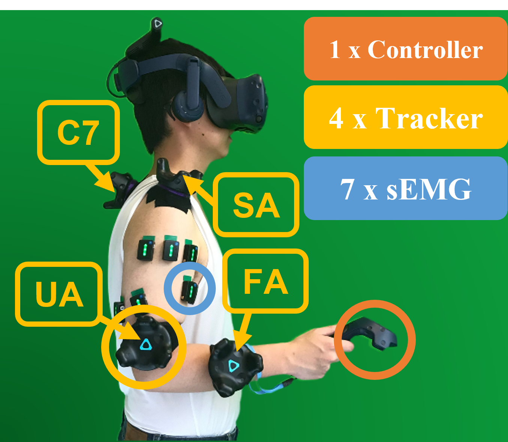
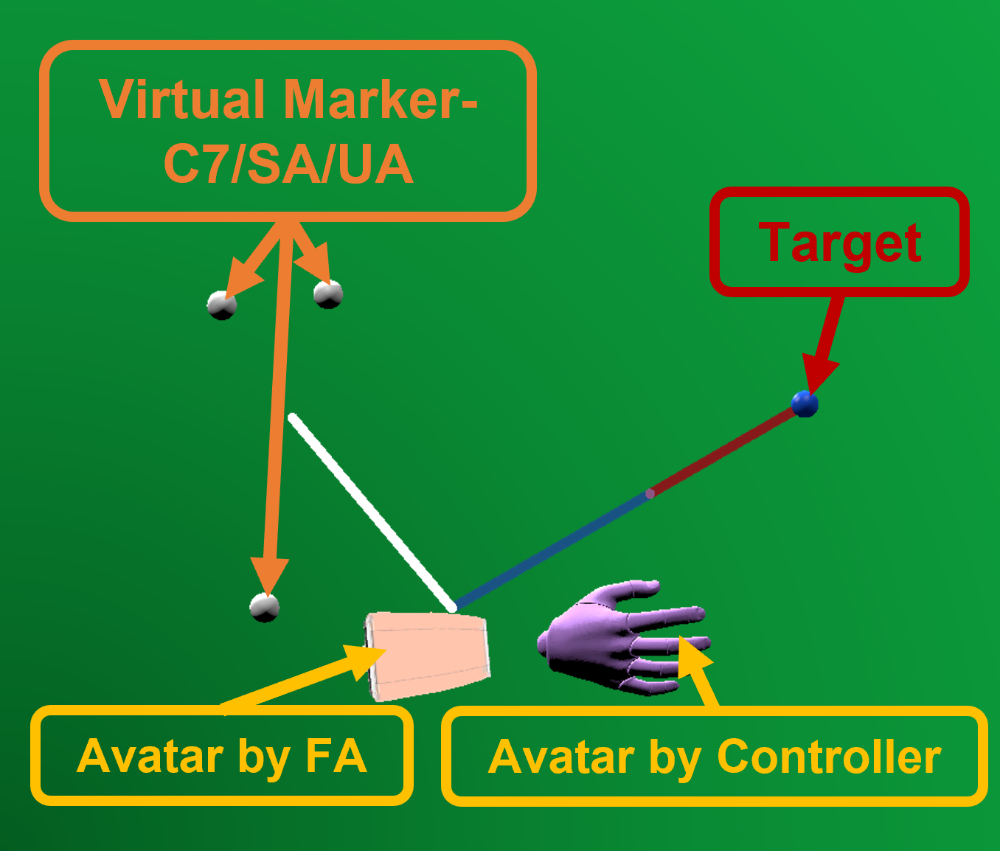
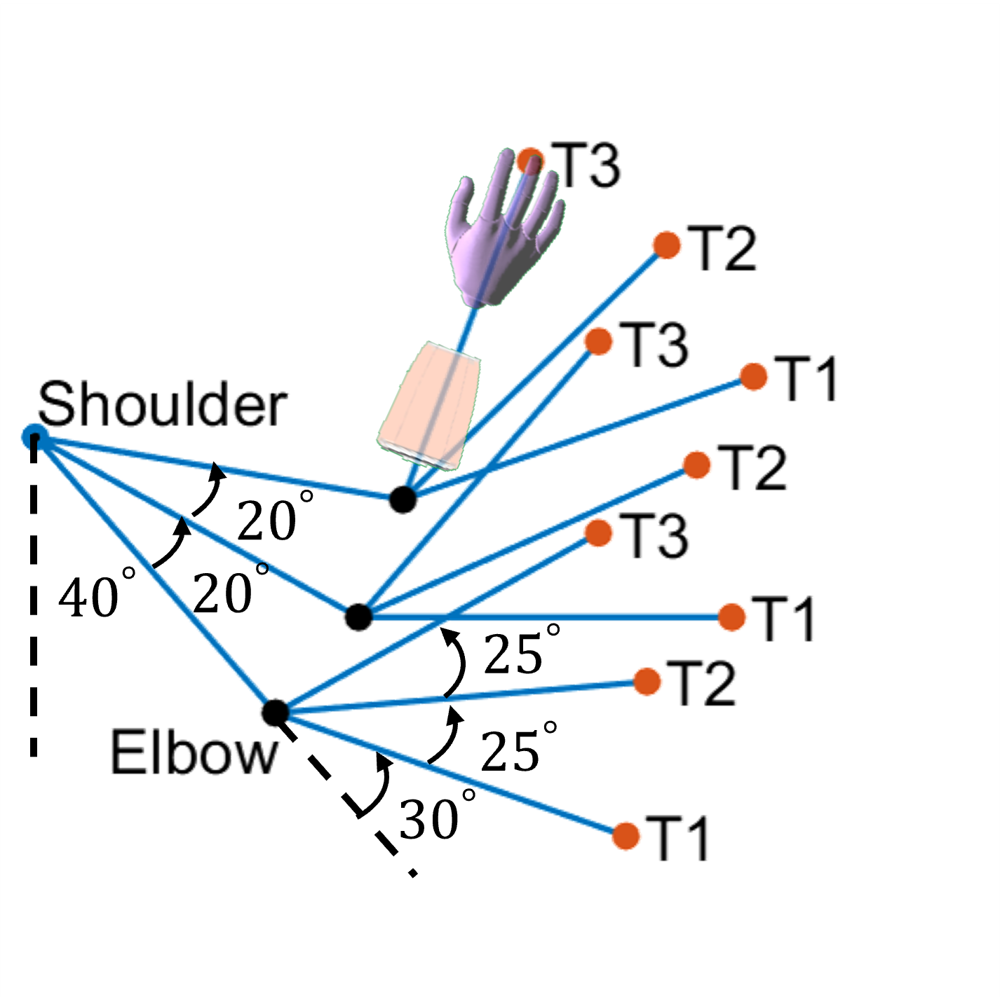

# Upper Limb Forward-reaching Data from Non-disabled Human Subjects

## Introduction
This dataset captures the upper limb and trunk movement kinematics， as well as surface electromyography (sEMG) data from the upper-arm muscles, of 10 non-disabled human subjects. The data was collected during forward-reaching actions towards 9 spatial locations in the parasagittal plane.

* The experiment was conducted in a head-mounted display (HMD) virtual reality (VR) environment. The setup and VR avatar is presented in Figure 1(a) and Figure 1(b), respectively.
* The spatial locations of the targets are designed to elicit specific upper limb joint displacements as illustrated in Figure 1(c). 

|  | | |
|:--:| :--:| :--:|
| *Figure 1(a) - Setup* | *Figure 1(b) - Virtual avatar*| *Figure 1(c) - Targets*|

## Usage
1. The [DataSet.csv](DataSet.csv) file contains all the features processed from kinematic and sEMG sensor measurements.

2. The definitions of headers:
* Non-features
    

    
Click to expand

    | Header        | Description   | 
    | ------------- |-------------|
    | Subject       | Subject number from 1 to 10|
    | Loc           | Label of 3 elbow poses from 0 to 2|
    | LocO          | Label of 9 spatial locations from 0 to 8|
    | Iteration     | Iteration number of the movement from 1 to 90|
    

    
* Kinematic feautres

    

    
Click to expand

    | Header        | Description   | 
    | ------------- |-------------|
    | Sfe & dSfe    | Shoulder flexion/extension pose (deg) and velocity (deg/s)|
    | Saa & dSaa    | Shoulder adduction/abduction pose (deg) and velocity (deg/s)|
    | Scde & dScde  | Scapular depression/elevation dispalcement (m) and velocity (m/s)|
    | Scpr & dScpr  | Scapular protraction/retraction dispalcement (m) and velocity (m/s)|
    | Tfe & dTfe    | Trunk flexion/extension pose (deg) and velocity (deg/s)|
    | Tb & dTb      | Trunk left/right bending pose (deg) and velocity (deg/s) |
    | Efe           | Elbow flexion/extension pose (deg) |
    

* sEMG features

    

    
Click to expand

    sEMG header names follow the format: [muscle]_[feature]

    | Muscle Header        | Description   | 
    | ------------- |-------------|
    | BSH           | Biceps brachii short head |
    | BLH           | Biceps brachii long head |
    | TLAH          | Triceps brachii lateral head|
    | TLH           | Triceps brachii long head |
    | DA            | Anterior deltoid |
    | DM            | Middle deltoid |
    | DP            | Posterior deltoid |

    | Feature Header        | Description   |
    | ------------- |-------------|
    | MAV           | Mean absolute value |
    | RMS           | Root mean square |
    | WL            | Wavelength    |
    | ZC            | Zero crossing |
    | SC            | Slope sign change |
    

## Data Collection Method
### Equipments
*  Head-mounted dispaly for VR environment: [HTC VIVE Pro](https://www.vive.com/au/product/vive-pro-full-kit/)
*  Kinematic sensors: [HTC VIVE trackers](https://www.vive.com/au/accessory/tracker3/), sampling rate 90 Hz.
*  sEMG sensors: [Delsys Trigno](https://delsys.com/trigno/) wireless surface electromyography electrodes, sampling rate 1111 Hz
*  Experimental platform: [VRProEP](https://github.com/UniMelbHumanRoboticsLab/VRProEP.git) developed by Dr. Ricardo Garcia Rosas, currently maintained by Tianshi Yu, branch v0.6.2, Unity version 2019.3.0f6.

### Methods
* For the details about the experimental protocol please refer to the Section III of our [TNSRE paper](https://ieeexplore.ieee.org/document/10073539).
* A summary 
    

    
Click to expand

    - The sEMG features are extracted using a moving window of 200 ms with a 100 ms overlap.
    - The joint poses are determined based on the orientation readings of the trackers and downsampled to 10 Hz using the same moving window.
    - The joint velocities are obtained by differentiating the poses and also downsampled to 10 Hz.
    

## Human Research Ethics
The experiment was approved by the University of Melbourne Human Research Ethics Committee, project ID 11878.

## Related Publication
* [T. Yu, A. Mohammadi, Y. Tan, P. Choong and D. Oetomo, "Sensor Selection With Composite Features in Identifying User-Intended Poses for Human-Prosthetic Interfaces," in IEEE Transactions on Neural Systems and Rehabilitation Engineering, vol. 31, pp. 1732-1742, 2023, doi: 10.1109/TNSRE.2023.3258225.](https://ieeexplore.ieee.org/document/10073539)  ----- [Code availability]()

* [T. Yu, R. Garcia-Rosas, A. Mohammadi, Y. Tan, P. Choong and D. Oetomo, "Comparing the Outcomes of Population-averaged and Personalised Input Feature Selection for Transhumeral Prosthetic Interfaces," 2021 IEEE International Conference on Systems, Man, and Cybernetics (SMC), Melbourne, Australia, 2021, pp. 417-422, doi: 10.1109/SMC52423.2021.9659209.](https://ieeexplore.ieee.org/abstract/document/9659209)

* [T. Yu, R. Garcia-Rosas, A. Mohammadi, Y. Tan, P. Choong and D. Oetomo, "Separability of Input Features and the Resulting Accuracy in Classifying Target Poses for Active Transhumeral Prosthetic Interfaces," 2021 43rd Annual International Conference of the IEEE Engineering in Medicine & Biology Society (EMBC), Mexico, 2021, pp. 4615-4618, doi: 10.1109/EMBC46164.2021.9630041.](https://ieeexplore.ieee.org/abstract/document/9630041)

## License

 CC BY 4.0 

## Contact
Tianshi Yu tianshiy@student.unimelb.edu.au, Human Robotics Laboratory, The University of Melbourne

